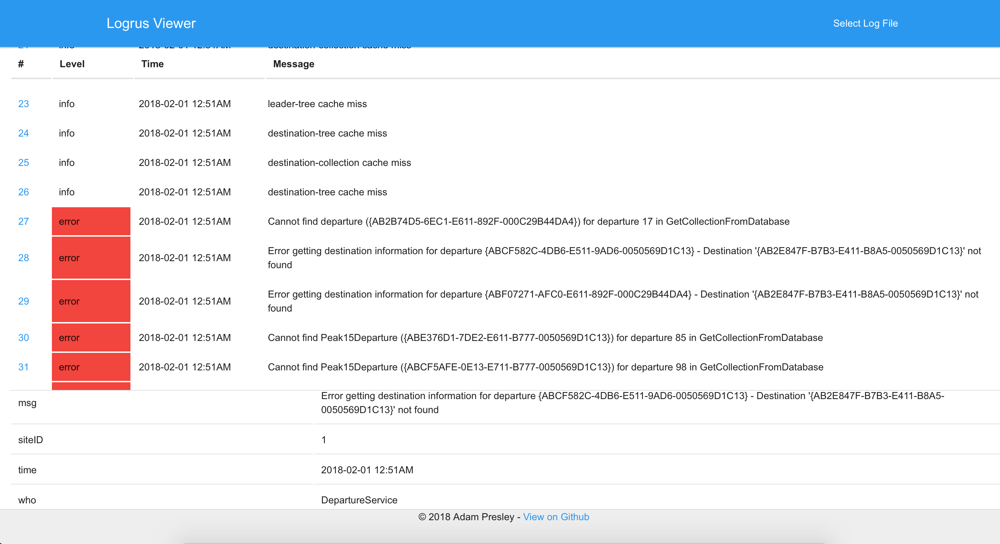

# Logrus Viewer

A tool to view logs generated by Logrus (the excellent Golang logger library).

## Description

[Logrus](https://github.com/sirupsen/logrus) is an excellent logging library for Google's Go language. It offers the ability to log entries in JSON format. It also provides the ability to attach additional fields and data to any given log entry. This viewer can read those logs and display them in a more readable format. Note that the viewer assumes at least three keys are present: **level**, **time**, and **msg**. As an example here is a JSON log file that Logrus Viewer can parse.

```
{"level":"info","msg":"leader-tree cache miss","siteID":1,"time":"2018-02-01T00:51:21-06:00","who":"LeaderService"}
{"level":"info","msg":"destination-tree cache miss","siteID":1,"time":"2018-02-01T00:51:21-06:00","who":"APIService"}
{"level":"info","msg":"destination-collection cache miss","siteID":1,"time":"2018-02-01T00:51:21-06:00","who":"APIService"}
{"level":"info","msg":"destination-tree cache miss","siteID":1,"time":"2018-02-01T00:51:23-06:00","who":"APIService"}
{"level":"error","msg":"Cannot find departure ({AB2B74D5-6EC1-E611-892F-000C29B44DA4}) for departure 17 in GetCollectionFromDatabase","siteID":1,"time":"2018-02-01T00:51:23-06:00","who":"DepartureService"}
{"level":"error","msg":"Error getting destination information for departure {ABCF582C-4DB6-E511-9AD6-0050569D1C13} - Destination '{AB2E847F-B7B3-E411-B8A5-0050569D1C13}' not found","siteID":1,"time":"2018-02-01T00:51:23-06:00","who":"DepartureService"}
{"level":"error","msg":"Error getting destination information for departure {ABF07271-AFC0-E611-892F-000C29B44DA4} - Destination '{AB2E847F-B7B3-E411-B8A5-0050569D1C13}' not found","siteID":1,"time":"2018-02-01T00:51:23-06:00","who":"DepartureService"}
{"level":"error","msg":"Cannot find Peak15Departure ({ABE376D1-7DE2-E611-B777-0050569D1C13}) for departure 85 in GetCollectionFromDatabase","siteID":1,"time":"2018-02-01T00:51:24-06:00","who":"DepartureService"}
{"level":"error","msg":"Cannot find Peak15Departure ({ABCF5AFE-0E13-E711-B777-0050569D1C13}) for departure 98 in GetCollectionFromDatabase","siteID":1,"time":"2018-02-01T00:51:25-06:00","who":"DepartureService"}
```

Given the above sample here is what that would look like in Logrus Viewer.



## Compiling

Logrus Viewer is written in Go 1.9.x. It also makes use of the tool [Esc](https://github.com/mjibson/esc) for embedding static assets, so make sure you have that installed too. With all the tools installed clone this repository to `$GOPATH/src/github.com/adampresley`. Then in the **logrusviewer** directory that is created run the following.

```
$ go generate
$ go run ./*.go
```

Once it is running you should be able to open `http://localhost:8080` in your browser.

## Command Line Flags

* **host** - Address and port to bind to. Defaults to `0.0.0.0:8080`
* **loglevel** - What level to log entries. Defaults to `info`. Valid values are `error`, `info`, and `debug`

## License

MIT License

Copyright (c) 2018 Adam Presley

Permission is hereby granted, free of charge, to any person obtaining a copy
of this software and associated documentation files (the "Software"), to deal
in the Software without restriction, including without limitation the rights
to use, copy, modify, merge, publish, distribute, sublicense, and/or sell
copies of the Software, and to permit persons to whom the Software is
furnished to do so, subject to the following conditions:

The above copyright notice and this permission notice shall be included in all
copies or substantial portions of the Software.

THE SOFTWARE IS PROVIDED "AS IS", WITHOUT WARRANTY OF ANY KIND, EXPRESS OR
IMPLIED, INCLUDING BUT NOT LIMITED TO THE WARRANTIES OF MERCHANTABILITY,
FITNESS FOR A PARTICULAR PURPOSE AND NONINFRINGEMENT. IN NO EVENT SHALL THE
AUTHORS OR COPYRIGHT HOLDERS BE LIABLE FOR ANY CLAIM, DAMAGES OR OTHER
LIABILITY, WHETHER IN AN ACTION OF CONTRACT, TORT OR OTHERWISE, ARISING FROM,
OUT OF OR IN CONNECTION WITH THE SOFTWARE OR THE USE OR OTHER DEALINGS IN THE
SOFTWARE.
